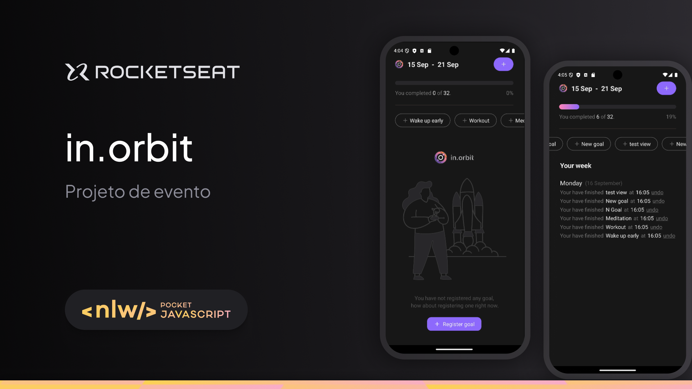

# Next Level Week 17 - Full Stack Application Overview

This project consists of a full-stack application developed during the 17th edition of the Next Level Week, held from September 9 to 11, 2024. It includes a React Native front-end application and a Fastify-based Node.js back-end API.

<div style="display: flex; with: auto; gap: 16px; justify-content: center">
    
</div>

## Project Overview

The application focuses on managing user goals. The front-end allows users to create, update, and monitor their goals, interacting with the back-end API for data persistence and retrieval. Key features include goal creation, tracking pending goals, and marking goals as completed.

---

## Front-End Application

The front-end of this application was developed using **React Native** and **Expo**. It provides a user-friendly interface for managing goals, allowing users to create new goals, view pending goals, and mark them as complete.

### Technologies Used

- **React Native**: For building mobile applications using React.
- **Expo**: A platform for developing and testing React Native apps.
- **React Navigation**: For app navigation and routing.
- **React Query**: For data fetching and synchronization.
- **Day.js**: A lightweight date library for date manipulation.
- **NativeWind**: Utility-first CSS for React Native.

### Installation and Setup

#### Prerequisites

- Node.js
- Android Studio (for emulation) or the Expo app on your phone

#### Installation

1. **Clone the Repository**

   ```bash
   git clone https://github.com/yourusername/starting-with-rn.git
   cd starting-with-rn
   ```

2. **Install Dependencies**

   ```bash
   npm install
   ```

#### Running the Application

- **Android Device/Emulator**: Ensure an Android emulator is running or connect an Android device via USB.

   ```bash
   npx react-native run-android
   ```

- **iOS Simulator** (Requires macOS with Xcode installed):

   ```bash
   npx react-native run-ios
   ```

- **Web**:

   ```bash
   npx expo start --web
   ```

#### API Endpoints Overview

- **Get Summary**: Fetches a summary of the user's goals.
- **Create Goal Completion**: Marks a goal as completed.
- **Create New Goal**: Allows the creation of new goals.
- **Decrement Goal Completion**: Removes a completion mark from a goal.
- **Get Pending Goals**: Retrieves a list of pending goals.

---

## Back-End Application

The back-end is a Fastify-based API built with **Node.js**. It manages the application's data, allowing clients to create, retrieve, and modify goals stored in a **PostgreSQL** database.

### Technologies Used

- **Node.js**: JavaScript runtime for server-side programming.
- **Fastify**: A fast and efficient API framework.
- **Zod**: For schema validation.
- **Docker Compose**: To manage multi-container Docker applications.
- **Drizzle ORM**: Object-Relational Mapping for database interactions.
- **PostgreSQL**: Relational database.

### Setup and Execution

#### Prerequisites

- Docker
- Docker Compose
- Node.js

#### Setup

1. **Clone the Repository**

   ```bash
   git clone https://github.com/Frankdias92/NLW-Pocket
   cd NLW-Pocket
   ```

2. **Create a `.env` File**

   Rename `.env.example` to `.env` and configure the environment variables:

   ```env
   APP_PORT=3333

   POSTGRES_HOST=db
   POSTGRES_PORT=5432
   POSTGRES_USER=docker
   POSTGRES_PASSWORD=docker
   POSTGRES_DB=inorbit
   DATABASE_URL=postgresql://docker:docker@db:5432/inorbit
   ```

#### Running the Application

1. **Build and Run Containers**

   Use Docker Compose to set up the database and application containers:

   ```bash
   docker-compose up --build -d
   ```

2. **Run Scripts Manually** (if needed)

   ```bash
   docker-compose exec app ./scripts/init.sh
   ```

#### Scripts and Commands

- **`scripts/init.sh`**: Applies database migrations, seeds data, and starts the server.
- **`npm run migration`**: Applies database migrations.
- **`npm run seed`**: Seeds the database with initial data.
- **`npm run dev`**: Starts the development server.

